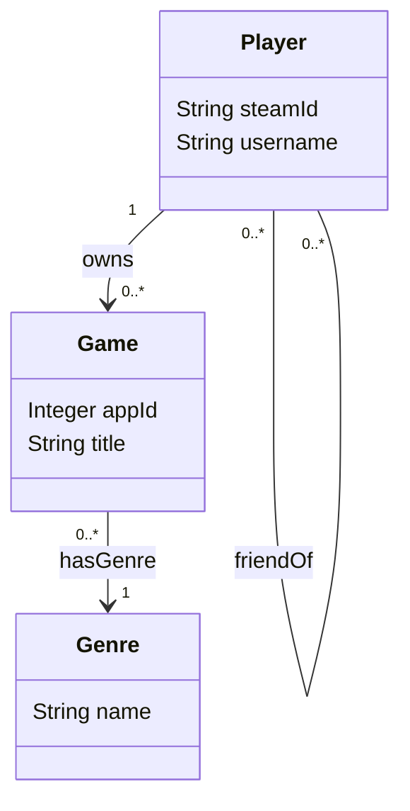
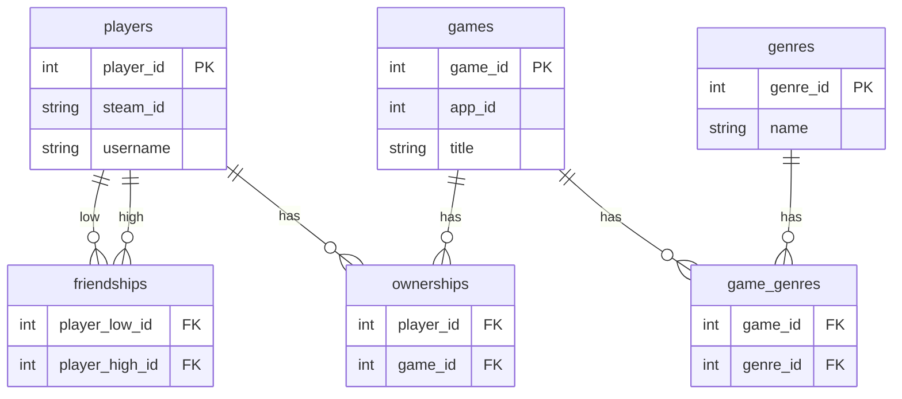
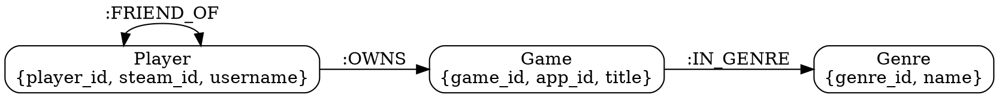

# Реляционная и графовая базы данных

**Предметная область:** игровая соцсеть Steam (упрощённая модель)

## Цель работы

Сравнить два подхода к работе с данными:

- **реляционный** — PostgreSQL;
- **сетевой (графовый)** — Neo4j (Labeled Property Graph).

На одних и тех же синтетических данных реализованы модели, запросы Q1–Q5 и замеры производительности.

**Файлы решения:**

- [psql/schema.dbml](psql/schema.dbml), [psql/schema.sql](psql/schema.sql), [psql/queries.sql](psql/queries.sql) — реляционная модель;
- [neo4j/lpg.md](neo4j/lpg.md), [neo4j/queries.cypher](neo4j/queries.cypher) — графовая модель;
- [scripts/benchmark.py](scripts/benchmark.py), [scripts/seed.py](scripts/seed.py), [scripts/load_dataset.py](scripts/load_dataset.py) — заливка и бенчмарк;
- [data/games_sample.csv](data/games_sample.csv) — каталог игр;
- [docker-compose.yml](docker-compose.yml) — PostgreSQL 16 и Neo4j 5.

---

## 1. Предметная область

Рассматривается упрощённый фрагмент экосистемы Steam: **игроки**, **игры**, **жанры**, связи **владения**, **дружбы** и **принадлежности игры к жанру**. Цель модели — рекомендации и анализ социального графа вокруг библиотек игр.

### 1.1. Сущности предметной области

- **Игрок (Player)** — пользователь с идентификатором Steam и именем.
- **Игра (Game)** — продукт каталога (App ID, название).
- **Жанр (Genre)** — классификация игр (Action, RPG, …).

Связи: **Владение** (игрок — игра), **Дружба** (игрок — игрок), **Жанр игры** (игра — жанр).

### 1.2. Правила в предметной области

1. Игрок может владеть неограниченным количеством игр.
2. Игра может относиться к нескольким жанрам в реальности; в модели для упрощения — **один основной жанр** на игру.
3. Дружба между игроками **симметрична** (если A друг B, то B друг A).
4. Рекомендации опираются на библиотеки **прямых друзей** и пересечение жанров.
5. Игрок **не может** владеть одной и той же игрой дважды.

### 1.3. Упрощения в модели предметной области

1. Учитывается только факт владения, без даты покупки, часов и достижений.
2. Все друзья равнозначны; не учитываются различия в количестве общей активности.
3. Для каждой игры хранится один основной жанр.
4. Игрок может владеть игрой без дополнительных условий: не моделируются региональные ограничения и DLC, для которых обязательна покупка базовой игры.

### 1.4. Вопросы к предметной области

1. **Q1.** Какие игры отсутствуют у игрока X, но есть у его друзей?
2. **Q2.** Какие жанры популярны среди друзей X?
3. **Q3.** Какие пары игр часто встречаются вместе в библиотеках (top-10)?
4. **Q4.** Рекомендация с объяснением: игра Y рекомендуется, потому что **N** друзей играют в Y, и **K** из них также играют в игры **того же жанра**, что есть у X.
5. **Q5.** «Дыры в жанре»: top-5 игроков, наиболее похожих на X по библиотеке (Jaccard на владении), затем игры, которые есть **минимум у 4 из 5** двойников, но **нет у X** (ранжирование по `twin_coverage`).

Параметр запросов: `player_id` (по умолчанию `1`). Q3 — глобальный (без `player_id`).

### 1.5. Модель предметной области (UML)




**Рисунок 1** — модель предметной области: игрок владеет играми, дружит с игроками; игра принадлежит жанру. Дружба симметрична, пара (игрок, игра) уникальна.

### 1.6. Модель сущностных отношений (ER)




**Рисунок 2** — ER-модель. Связи M:N нормализованы через `ownerships`, `game_genres`, `friendships` (симметричная дружба: `player_low_id < player_high_id`).

---

## 2. О реляционной модели

### 2.1. ER-диаграмма в нотации DBML

```dbml
Table players {
  player_id int [pk, increment]
  steam_id varchar [unique, not null]
  username varchar [not null]
}

Table games {
  game_id int [pk, increment]
  app_id int [unique, not null]
  title varchar [not null]
}

Table genres {
  genre_id int [pk, increment]
  name varchar [unique, not null]
}

Table game_genres {
  game_id int [not null, ref: > games.game_id]
  genre_id int [not null, ref: > genres.genre_id]
  indexes {
    (game_id, genre_id) [pk]
  }
}

Table ownerships {
  player_id int [not null, ref: > players.player_id]
  game_id int [not null, ref: > games.game_id]
  indexes {
    (player_id, game_id) [pk]
  }
}

Table friendships {
  player_low_id int [not null, ref: > players.player_id]
  player_high_id int [not null, ref: > players.player_id]
  indexes {
    (player_low_id, player_high_id) [pk]
  }
}
```

**Листинг 1** — отношения сущностей в нотации DBML. Связи M:N нормализованы через junction-таблицы; в `friendships` хранится одна запись на пару (`low < high`).

### 2.2. Создание и наполнение

PostgreSQL 16 и Neo4j 5 поднимаются через `docker compose up -d`. Схема создаётся при заливке скриптом `scripts/benchmark.py` или `scripts/seed.py`.

DDL PostgreSQL:

```sql
CREATE TABLE IF NOT EXISTS players (
    player_id SERIAL PRIMARY KEY,
    steam_id VARCHAR(64) NOT NULL UNIQUE,
    username VARCHAR(128) NOT NULL
);

CREATE TABLE IF NOT EXISTS games (
    game_id SERIAL PRIMARY KEY,
    app_id INTEGER NOT NULL UNIQUE,
    title VARCHAR(512) NOT NULL
);

CREATE TABLE IF NOT EXISTS genres (
    genre_id SERIAL PRIMARY KEY,
    name VARCHAR(64) NOT NULL UNIQUE
);

CREATE TABLE IF NOT EXISTS game_genres (
    game_id INTEGER NOT NULL REFERENCES games(game_id),
    genre_id INTEGER NOT NULL REFERENCES genres(genre_id),
    PRIMARY KEY (game_id, genre_id)
);
CREATE INDEX IF NOT EXISTS ix_game_genres_genre_id ON game_genres(genre_id);

CREATE TABLE IF NOT EXISTS ownerships (
    player_id INTEGER NOT NULL REFERENCES players(player_id),
    game_id INTEGER NOT NULL REFERENCES games(game_id),
    PRIMARY KEY (player_id, game_id)
);
CREATE INDEX IF NOT EXISTS ix_ownerships_game_id ON ownerships(game_id);
CREATE INDEX IF NOT EXISTS ix_ownerships_player_id ON ownerships(player_id);

CREATE TABLE IF NOT EXISTS friendships (
    player_low_id INTEGER NOT NULL REFERENCES players(player_id),
    player_high_id INTEGER NOT NULL REFERENCES players(player_id),
    PRIMARY KEY (player_low_id, player_high_id),
    CHECK (player_low_id < player_high_id)
);
CREATE INDEX IF NOT EXISTS ix_friendships_low ON friendships(player_low_id);
CREATE INDEX IF NOT EXISTS ix_friendships_high ON friendships(player_high_id);
```

Данные: CSV каталога игр (~48 названий) + синтетические игроки, дружба и владение (`scripts/load_dataset.py`, seed=42). Масштабы: **S**, **M**, **L**, **XL** (см. раздел 4).

### 2.3. Запросы

```sql
-- Q1: Игры, которых нет у X, но есть у его друзей
SELECT DISTINCT g.game_id, g.title
FROM games g
JOIN ownerships o ON o.game_id = g.game_id
JOIN friendships f ON (
    (f.player_low_id = :player_id AND o.player_id = f.player_high_id)
    OR (f.player_high_id = :player_id AND o.player_id = f.player_low_id)
)
WHERE NOT EXISTS (
    SELECT 1 FROM ownerships ox
    WHERE ox.player_id = :player_id AND ox.game_id = g.game_id
)
ORDER BY g.title;

-- Q2: Популярные жанры среди друзей X
SELECT gr.name AS genre, COUNT(*) AS friend_ownerships
FROM friendships f
JOIN ownerships o ON (
    (f.player_low_id = :player_id AND o.player_id = f.player_high_id)
    OR (f.player_high_id = :player_id AND o.player_id = f.player_low_id)
)
JOIN game_genres gg ON gg.game_id = o.game_id
JOIN genres gr ON gr.genre_id = gg.genre_id
GROUP BY gr.genre_id, gr.name
ORDER BY friend_ownerships DESC, gr.name;

-- Q3: Top-10 пар игр по co-ownership
SELECT g1.title AS game1, g2.title AS game2, COUNT(*) AS coowners
FROM ownerships o1
JOIN ownerships o2 ON o1.player_id = o2.player_id AND o1.game_id < o2.game_id
JOIN games g1 ON g1.game_id = o1.game_id
JOIN games g2 ON g2.game_id = o2.game_id
GROUP BY o1.game_id, o2.game_id, g1.title, g2.title
ORDER BY coowners DESC, g1.title, g2.title
LIMIT 10;

-- Q4: N друзей играют в Y, K из них — в жанрах из библиотеки X
WITH friend_owned AS (
    SELECT DISTINCT fo.player_id AS friend_id, g.game_id, g.title
    FROM friendships f
    JOIN ownerships fo ON (
        (f.player_low_id = :player_id AND fo.player_id = f.player_high_id)
        OR (f.player_high_id = :player_id AND fo.player_id = f.player_low_id)
    )
    JOIN games g ON g.game_id = fo.game_id
    WHERE NOT EXISTS (
        SELECT 1 FROM ownerships ox
        WHERE ox.player_id = :player_id AND ox.game_id = g.game_id
    )
)
SELECT fo.game_id, fo.title,
       COUNT(DISTINCT fo.friend_id) AS friend_count,
       COUNT(DISTINCT fo.friend_id) FILTER (WHERE EXISTS (
           SELECT 1
           FROM ownerships o_sim
           JOIN game_genres gg_sim ON gg_sim.game_id = o_sim.game_id
           JOIN ownerships o_mine ON o_mine.player_id = :player_id
           JOIN game_genres gg_mine ON gg_mine.game_id = o_mine.game_id
           WHERE o_sim.player_id = fo.friend_id
             AND gg_sim.genre_id = gg_mine.genre_id
       )) AS similar_friend_count
FROM friend_owned fo
GROUP BY fo.game_id, fo.title
ORDER BY friend_count DESC, similar_friend_count DESC, fo.title
LIMIT 10;

-- Q5: Игры у top-5 двойников (Jaccard), которых нет у X
WITH my_games AS (
    SELECT game_id FROM ownerships WHERE player_id = :player_id
),
my_count AS (
    SELECT COUNT(*) AS n FROM my_games
),
player_sets AS (
    SELECT p.player_id,
           COUNT(*) FILTER (WHERE o.game_id IN (SELECT game_id FROM my_games)) AS inter_cnt,
           (SELECT n FROM my_count) + COUNT(DISTINCT o.game_id)
             - COUNT(*) FILTER (WHERE o.game_id IN (SELECT game_id FROM my_games)) AS union_cnt
    FROM players p
    JOIN ownerships o ON o.player_id = p.player_id
    WHERE p.player_id != :player_id
    GROUP BY p.player_id
),
top_twins AS (
    SELECT player_id AS twin_id
    FROM player_sets
    WHERE union_cnt > 0
    ORDER BY inter_cnt::float / union_cnt DESC, player_id
    LIMIT 5
),
twin_count AS (
    SELECT COUNT(*) AS n FROM top_twins
),
gap_games AS (
    SELECT o.game_id, COUNT(DISTINCT o.player_id) AS twin_coverage
    FROM ownerships o
    JOIN top_twins t ON t.twin_id = o.player_id
    GROUP BY o.game_id
    HAVING COUNT(DISTINCT o.player_id) >= LEAST(4, (SELECT n FROM twin_count))
)
SELECT g.game_id, g.title, ug.twin_coverage
FROM gap_games ug
JOIN games g ON g.game_id = ug.game_id
WHERE ug.game_id NOT IN (SELECT game_id FROM my_games)
ORDER BY ug.twin_coverage DESC, g.title
LIMIT 10;
```

---

## 3. О графовой (сетевой) модели

### 3.1. Labeled Property Graph (LPG)



**Листинг 2** — описание графа (Graphviz/DOT). Узлы заданы метками и свойствами, рёбра — типами связей. Обход `(Player)-[:FRIEND_OF]-(Player)-[:OWNS]->(Game)` не требует JOIN по внешним ключам.

Ограничения Neo4j:

```cypher
CREATE CONSTRAINT player_id IF NOT EXISTS
  FOR (p:Player) REQUIRE p.player_id IS UNIQUE;
CREATE CONSTRAINT game_id IF NOT EXISTS
  FOR (g:Game) REQUIRE g.game_id IS UNIQUE;
CREATE CONSTRAINT genre_id IF NOT EXISTS
  FOR (g:Genre) REQUIRE g.genre_id IS UNIQUE;
```

### 3.2. Создание, наполнение и запросы

Наполнение: bulk `MERGE` узлов и связей из того же `Dataset`, что и PostgreSQL. Запросы:

```cypher
// Q1
MATCH (x:Player {player_id: $player_id})-[:FRIEND_OF]-(f:Player)-[:OWNS]->(g:Game)
WHERE NOT (x)-[:OWNS]->(g)
RETURN DISTINCT g.game_id AS game_id, g.title AS title
ORDER BY title;

// Q2
MATCH (x:Player {player_id: $player_id})-[:FRIEND_OF]-(f:Player)-[:OWNS]->(g:Game)-[:IN_GENRE]->(gn:Genre)
RETURN gn.name AS genre, count(*) AS friend_ownerships
ORDER BY friend_ownerships DESC, genre;

// Q3
MATCH (g1:Game)<-[:OWNS]-(p:Player)-[:OWNS]->(g2:Game)
WHERE g1.game_id < g2.game_id
WITH g1, g2, count(p) AS coowners
RETURN g1.title AS game1, g2.title AS game2, coowners
ORDER BY coowners DESC, game1, game2
LIMIT 10;

// Q4
MATCH (x:Player {player_id: $player_id})
MATCH (x)-[:FRIEND_OF]-(f:Player)-[:OWNS]->(g:Game)
WHERE NOT (x)-[:OWNS]->(g)
OPTIONAL MATCH (f)-[:OWNS]->(:Game)-[:IN_GENRE]->(gn:Genre)<-[:IN_GENRE]-(:Game)<-[:OWNS]-(x)
WITH g, f, count(gn) > 0 AS has_similar
RETURN g.game_id AS game_id, g.title AS title,
       count(DISTINCT f) AS friend_count,
       count(DISTINCT CASE WHEN has_similar THEN f END) AS similar_friend_count
ORDER BY friend_count DESC, similar_friend_count DESC, title
LIMIT 10;

// Q5
MATCH (me:Player {player_id: $player_id})-[:OWNS]->(mg:Game)
WITH me, collect(DISTINCT mg.game_id) AS myGames
MATCH (other:Player)
WHERE other <> me
OPTIONAL MATCH (other)-[:OWNS]->(og:Game)
WITH me, myGames, other, collect(DISTINCT og.game_id) AS theirGames
WITH me, myGames, other,
     size([g IN myGames WHERE g IN theirGames]) AS inter,
     size(myGames) + size(theirGames) - size([g IN myGames WHERE g IN theirGames]) AS unionSize
WHERE unionSize > 0
WITH me, myGames, other, inter * 1.0 / unionSize AS jaccard
ORDER BY jaccard DESC, other.player_id
LIMIT 5
WITH me, myGames, collect(other) AS twins
UNWIND twins AS t
MATCH (t)-[:OWNS]->(g:Game)
WITH me, myGames, g, count(DISTINCT t) AS twinOwns, size(twins) AS twinCount
WHERE twinOwns >= CASE WHEN twinCount >= 4 THEN 4 ELSE twinCount END
  AND NOT g.game_id IN myGames
RETURN DISTINCT g.game_id AS game_id, g.title AS title, twinOwns AS twin_coverage
ORDER BY twin_coverage DESC, title
LIMIT 10;
```

---

## 4. Сравнение реализаций и выводы

### 4.1. Сложность запросов


| Критерий                          | PostgreSQL                                                  | Neo4j                                    |
| --------------------------------- | ----------------------------------------------------------- | ---------------------------------------- |
| **Связь M:N**                     | Junction-таблицы `ownerships`, `game_genres`, `friendships` | Рёбра `:OWNS`, `:IN_GENRE`, `:FRIEND_OF` |
| **Обход «игрок → друзья → игры»** | JOIN + NOT EXISTS                                           | Один MATCH-паттерн                       |
| **Q3 (пары игр)**                 | Self-join `ownerships`                                      | Два `:OWNS` от одного `Player`           |
| **Q4 (жанровая близость)**        | CTE + EXISTS по `game_genres`                               | OPTIONAL MATCH по `:IN_GENRE`            |
| **Q5 (Jaccard)**                  | CTE + `FILTER` + `HAVING`                                   | `collect` + list comprehension           |
| **Целостность**                   | FK, UNIQUE, CHECK                                           | Constraints на id                        |


### 4.2. Сверка ответов PostgreSQL и Neo4j

На каждом масштабе данных (`scripts/benchmark.py`, `player_id=1`) результаты Q1–Q5 **идентичны**:


| Масштаб | Q1           | Q2         | Q3           | Q4           | Q5           |
| ------- | ------------ | ---------- | ------------ | ------------ | ------------ |
| **S**   | OK (32 = 32) | OK (7 = 7) | OK (10 = 10) | OK (10 = 10) | OK (10 = 10) |
| **M**   | OK (66 = 66) | OK (8 = 8) | OK (10 = 10) | OK (10 = 10) | OK (10 = 10) |
| **L**   | OK (87 = 87) | OK (8 = 8) | OK (10 = 10) | OK (10 = 10) | OK (10 = 10) |
| **XL**  | OK (95 = 95) | OK (8 = 8) | OK (10 = 10) | OK (10 = 10) | OK (10 = 10) |


### 4.3. Объёмы тестовых данных


| Масштаб | players | games | ownerships | friendships |
| ------- | ------- | ----- | ---------- | ----------- |
| **S**   | 30      | 48    | 493        | 97          |
| **M**   | 200     | 500   | 5 471      | 1 285       |
| **L**   | 1 000   | 2 000 | 52 566     | 8 815       |
| **XL**  | 2 500   | 4 000 | 103 506    | 24 774      |


Рост ownerships: S→M ×11.1, M→L ×9.6, L→XL ×1.97, **S→XL ×210**.

### 4.4. Производительность (Docker, median мс, 5 повторов)

Замеры: `python -u scripts/benchmark.py --scales all`.


| Запрос | S PG | S Neo4j | M PG | M Neo4j | L PG   | L Neo4j | XL PG  | XL Neo4j |
| ------ | ---- | ------- | ---- | ------- | ------ | ------- | ------ | -------- |
| Q1     | 1.6  | 3.0     | 2.6  | 3.3     | 1.7    | 4.9     | 3.1    | 6.4      |
| Q2     | 1.5  | 1.5     | 1.8  | 1.8     | 1.6    | 2.3     | 1.9    | 2.4      |
| Q3     | 3.0  | 2.8     | 62.7 | 96.5    | 1311.7 | 2337.2  | 2173.9 | 7190.5   |
| Q4     | 2.9  | 5.7     | 6.7  | 16.7    | 53.5   | 44.7    | 4.4    | 86.6     |
| Q5     | 1.9  | 2.0     | 3.0  | 4.9     | 17.5   | 38.4    | 30.5   | 159.5    |


### 4.5. Относительный рост времени (масштабируемость)

Сравниваем, **во сколько раз** выросло median-время при росте данных (не абсолютные миллисекунды).

**S → XL** (ownerships ×210):


| Запрос | PostgreSQL      | Neo4j            | Медленнее растёт |
| ------ | --------------- | ---------------- | ---------------- |
| Q1     | ×1.9 (+95%)     | ×2.2 (+115%)     | PostgreSQL       |
| Q2     | ×1.3 (+26%)     | ×1.6 (+55%)      | PostgreSQL       |
| Q3     | ×719            | ×2559            | PostgreSQL       |
| **Q4** | **×1.5 (+48%)** | **×15 (+1410%)** | **PostgreSQL**   |
| Q5     | ×16 (+1550%)    | ×81 (+7900%)     | PostgreSQL       |


**L → XL** (ownerships ×1.97) — при почти удвоении всей БД:


| Запрос | PostgreSQL | Neo4j | Стабильнее |
| ------ | ---------- | ----- | ---------- |
| Q1     | ×1.85      | ×1.32 | Neo4j      |
| Q2     | ×1.21      | ×1.04 | Neo4j      |
| Q3     | ×1.66      | ×3.08 | PostgreSQL |
| Q4     | ×0.08      | ×1.94 | PostgreSQL |
| Q5     | ×1.74      | ×4.15 | PostgreSQL |


**Абсолютное время на S** (Neo4j быстрее):


| Запрос | PostgreSQL | Neo4j      |
| ------ | ---------- | ---------- |
| Q3     | 3.0 ms     | **2.8 ms** |


**Итог по масштабируемости:** PostgreSQL стабильно быстрее в абсолюте на **Q1, Q4, Q5** и лучше масштабируется на **Q4** (S→XL: ×1.5 vs ×15). Neo4j чуть быстрее на **Q3** при малых данных и **медленнее растёт** на **Q1, Q2** при переходе L→XL. **Q3** и **Q5** тяжёлые для обеих СУБД; на XL Neo4j особенно проигрывает на Q3 (self-join по всем `:OWNS`) и Q5 (полный перебор игроков с `collect`).

### 4.6. Выводы

Обе реализации отвечают на все пять вопросов и дают **одинаковые** ответы на всех масштабах S–XL.

PostgreSQL сильнее в **абсолютном времени** на локальных обходах с фильтрацией (Q1, Q4), на глобальных агрегатах (Q5) и на self-join (Q3 на L/XL). Neo4j выразительнее для паттернов «игрок → друзья → игры» в Cypher, но на наших объёмах это не всегда даёт выигрыш по времени; OPTIONAL MATCH в Q4 и полный scan в Q5 дороже, чем эквивалентные JOIN/CTE в SQL.

Итог: для отчётности, ACID и тяжёлых агрегатов — PostgreSQL; для декларативных обходов связей на умеренных объёмах — Neo4j, с осторожностью на запросах с OPTIONAL MATCH и глобальным перебором узлов.

---

## 5. Запуск

**Требования:** Python 3.10+, Docker Desktop.

```powershell
python -m venv .venv
.\.venv\Scripts\Activate.ps1
pip install -r requirements.txt
copy .env.example .env

docker compose up -d
python -u scripts\benchmark.py
```

Скрипт `benchmark.py` ждёт готовности БД, для каждого масштаба S/M/L/XL очищает и заливает данные, сверяет ответы PostgreSQL vs Neo4j, замеряет время и пишет JSON в `scripts/results/benchmark_results.json`.