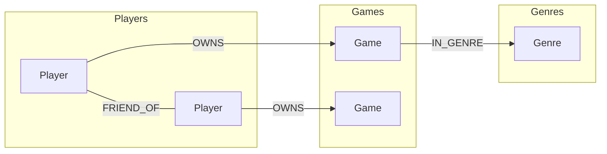

# Labeled Property Graph (LPG) — Steam

## Узлы (Labels + Properties)

| Label | Свойства | Описание |
|-------|----------|----------|
| `Player` | `player_id`, `steam_id`, `username` | Игрок |
| `Game` | `game_id`, `app_id`, `title` | Игра |
| `Genre` | `genre_id`, `name` | Жанр |

## Рёбра (Types + Direction)

| Тип | От | К | Свойства | Семантика |
|-----|----|---|----------|-----------|
| `OWNS` | `Player` | `Game` | — | Владение игрой |
| `IN_GENRE` | `Game` | `Genre` | — | Принадлежность к жанру (один на игру) |
| `FRIEND_OF` | `Player` | `Player` | — | Дружба (одно ребро на пару; обход `-[:FRIEND_OF]-`) |

## Диаграмма (Mermaid)



## Индексы и ограничения (Neo4j)

```cypher
CREATE CONSTRAINT player_id IF NOT EXISTS
  FOR (p:Player) REQUIRE p.player_id IS UNIQUE;
CREATE CONSTRAINT game_id IF NOT EXISTS
  FOR (g:Game) REQUIRE g.game_id IS UNIQUE;
CREATE CONSTRAINT genre_id IF NOT EXISTS
  FOR (g:Genre) REQUIRE g.genre_id IS UNIQUE;
CREATE INDEX game_app_id IF NOT EXISTS
  FOR (g:Game) ON (g.app_id);
```
